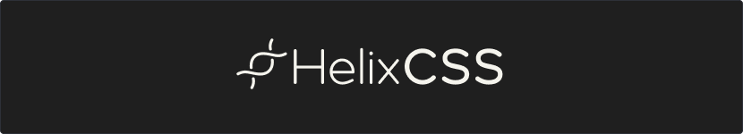

<div align="center">
  <h3>A modular CSS framework</h3>
  	<span>
		<span>&nbsp;&nbsp;·&nbsp;&nbsp;</span>
		<a href="#get-started">Get started</a>
		<span>&nbsp;&nbsp;·&nbsp;&nbsp;</span>
	</span>
</div>

<br/>
<br/>

## About

HelixCSS is a lightweight CSS framework designed to streamline web development and provide essential styling utilities for building modern web projects. With a focus on simplicity, performance, and modularity, HelixCSS offers a comprehensive set of classes to help developers create responsive and visually appealing layouts with ease.

### Features

- **Lightweight:** HelixCSS is optimized for performance, with a minified file size of only 50KB.
- **Modular:** Choose only the modules you need for your project, or use the complete framework for a comprehensive solution.
- **Responsive:** Built-in responsive grid system for creating flexible and adaptive layouts across various devices and screen sizes.
- **Customizable:** Easily customize and extend HelixCSS to suit your project's specific requirements.

<br/>

## Get started

To get started with HelixCSS, simply include the following CDN link in your HTML file:

**HTML**

```html
<!-- Compressed - 51KB -->
<link
  rel="stylesheet"
  href="https://cdn.jsdelivr.net/gh/Helixify/HelixCSS@latest/dist/compressed/main.css"
/>

<!-- Expanded - 70KB -->
<link
  rel="stylesheet"
  href="https://cdn.jsdelivr.net/gh/Helixify/HelixCSS@latest/dist/expanded/main.css"
/>
```

<br/>

**CSS**

```css
/* Compressed - 51KB */
@import url("https://cdn.jsdelivr.net/gh/Helixify/HelixCSS@latest/dist/compressed/main.css");

/* Expanded - 70KB */
@import url("https://cdn.jsdelivr.net/gh/Helixify/HelixCSS@latest/dist/expanded/main.css");
```

<br/>

## License

HelixColor is released under the [MIT License](/license.md). You are free to use and modify it for your projects.
